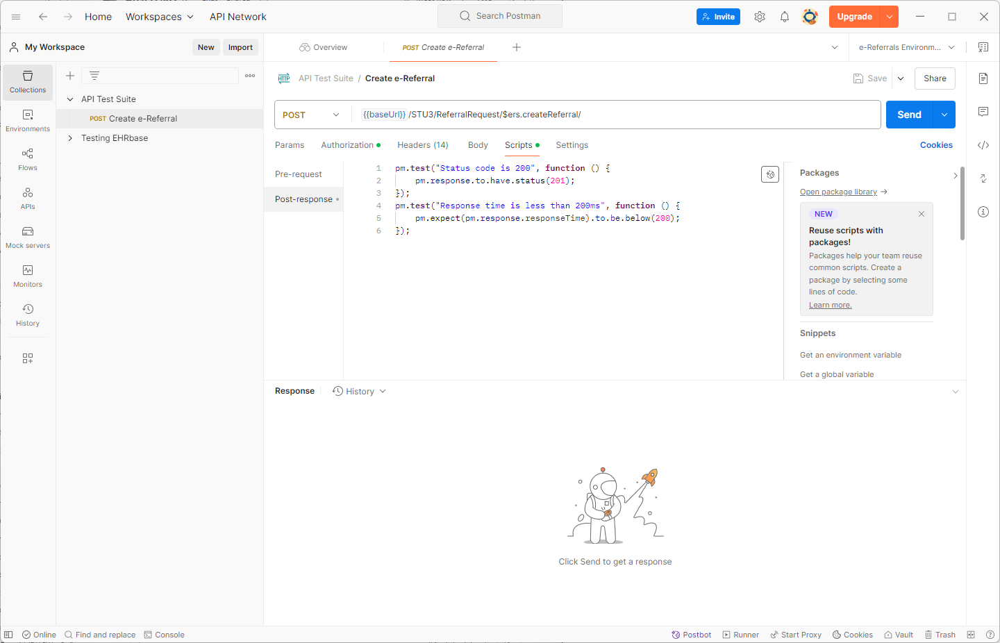

# Postman example using newman

Using Postman collections to form automated test suites using newman command line tools. 
An install of Postman on your development device is a pre-requist for this tutorial.

Demonstration of:

* [Postman](https://www.postman.com/) Postman is the single platform for designing, building, and scaling APIs.
* [Newman](https://github.com/postmanlabs/newman) Newman is a command-line collection runner for Postman.

## Install 

To run Newman, ensure that you have Node.js >= v16. Install (https://nodejs.org/en/download/package-manager/) Node.js via package manager.

### Install Newman

The easiest way to install Newman is using NPM. If you have Node.js installed, it is most likely that you have NPM installed as well:

```sh
npm install -g newman
```

This installs Newman globally on your system allowing you to run it from anywhere. If you want to install it locally, Just remove the -g flag.

### Using Homebrew

Install Newman globally on your system using Homebrew:

```sh
brew install newman
```

Check to see if it's installed:

```sh
newman --version
```

The output should be at least:

```sh
newman --version
6.2.1
```

## Creating a Postman Collection & Exporting your Postman Environment

To create a Postman collection, first, ensure that you are signed in to your Postman account. You can then create a collection through several methods:

### Steps to Create a Collection

1. **Sign in to Postman**  
   Ensure you are logged into your Postman account.

2. **Navigate to Collections**  
   Locate the **"Collections"** section in the sidebar.

3. **Create a New Collection**
   - **From Blank**: Select `+ > Blank collection` to create a new, empty collection.
   - **From New**: Click **"New"** in the sidebar, then choose **"Collection"**.
   - **From Template**: Use a pre-defined template to create a collection with sample structure and examples.
   - **From API Definition**: Import an API definition (e.g., OpenAPI, Swagger) to automatically generate a collection with the API's structure.

4. **Name and Configure the Collection**  
   Provide a name and an optional description. You can also configure additional settings for the collection.
   
   ## Adding Test Criteria to APIs in the Collection

Once you've added API requests to your collection, you can write scripts to automatically validate responses.

### Steps to Add Test Scripts (Postman 2024+ UI)

1. **Open the API Request**  
   In your collection, click on the request you want to test.

2. **Go to the "Scripts" Tab**  
   In the request panel, click the **"Scripts"** tab (replaces the old "Tests" and "Pre-request" tabs).

3. **Add Post-response Test Code**  
   Under the **"Post-response"** section, add JavaScript code to define your test criteria.

   #### Example: Basic Status Code Test
   ```javascript
   pm.test("Status code is 200", function () {
       pm.response.to.have.status(200);
   });
   ```
   
Here's what that may look like in Postman:



## Helpful Tips

- Use `pm.test`, `pm.expect`, and `pm.response` for clear and expressive test logic.
- You can also use the **Pre-request** section (in the same "Scripts" tab) for setup tasks like generating tokens or setting environment variables.

📚 For more examples and references, check out the [Postman test scripting guide](https://learning.postman.com/docs/writing-scripts/script-references/test-examples/).

## Exporting a Postman Collection as a JSON File

You can export your Postman collection to a `.json` file for sharing, version control, or importing into other tools.

### Steps to Export a Collection

1. **Go to the "Collections" Tab**  
   In the left-hand sidebar, click on **"Collections"** to view your saved collections.

2. **Click the Three-Dot Menu (⋮) Next to the Collection**  
   Hover over the collection you want to export, then click the **three-dot menu** on the right.
   
3. **Choose "Export"**  
   From the dropdown menu, select **Export**.
   


4. **Select Export Format**  
   A modal will appear with export format options:
   - Collection v2.1 (recommended)
   - Collection v2.0
   
5. **Save the exported file locally**
   Click the Export button, name the export file and save locally.
   

   
## Exporting a Postman Environment as a JSON File

Postman environments allow you to store and reuse variables across requests. You can export a specific environment to a `.json` file for sharing or version control.

### Steps to Export a Postman Environment

1. **Click on the "Environments" Icon**  
   In the left sidebar, click on the **gear icon** (⚙️) or select the **"Environments"** tab (this may also appear under **"Globals & Environments"** depending on your version).

2. **Find the Environment You Want to Export**  
   Locate the environment you wish to export in the list.

3. **Click the Three-Dot Menu (⋮) Next to the Environment**  
   Hover over the environment and click the **three-dot menu** on the right.

4. **Select "Export"**  
   Click **Export** from the dropdown menu.

5. **Save the `.json` File**  
   Choose a location on your computer to save the file. Postman will export the environment as a JSON file (e.g., `dev-environment.json`).

## Upload postman files

Newman will be driven now using your json test collection and your environment.  Upload using the tool of your choice to your server.

## Run your test collection against your service

Run the following command:

```sh
newman run -e <your-environment-file.json> <your-test-collection.json>
```

If all is well, you should see something similar to the following output:

```sh
dhcw@build02:~ $ newman run -e postman_environment.json api_collection.json
newman

API Test Suite

→ Create e-Referral
  POST http://localhost/referrals/FHIR/STU3/ReferralRequest/$ers.createReferral/ [201 Created, 222B, 148ms]
  ✓  Status code is 201
  ✓  Response time is less than 200ms

┌─────────────────────────┬────────────────────┬───────────────────┐
│                         │           executed │            failed │
├─────────────────────────┼────────────────────┼───────────────────┤
│              iterations │                  1 │                 0 │
├─────────────────────────┼────────────────────┼───────────────────┤
│                requests │                  1 │                 0 │
├─────────────────────────┼────────────────────┼───────────────────┤
│            test-scripts │                  1 │                 0 │
├─────────────────────────┼────────────────────┼───────────────────┤
│      prerequest-scripts │                  0 │                 0 │
├─────────────────────────┼────────────────────┼───────────────────┤
│              assertions │                  2 │                 0 │
├─────────────────────────┴────────────────────┴───────────────────┤
│ total run duration: 325ms                                        │
├──────────────────────────────────────────────────────────────────┤
│ total data received: 19B (approx)                                │
├──────────────────────────────────────────────────────────────────┤
│ average response time: 148ms [min: 148ms, max: 148ms, s.d.: 0µs] │
└──────────────────────────────────────────────────────────────────┘


```

You can now add this command as prat of you project buils  to your CI/CD pipeline.

## License

This repository is licensed under the [MIT License](LICENSE)
